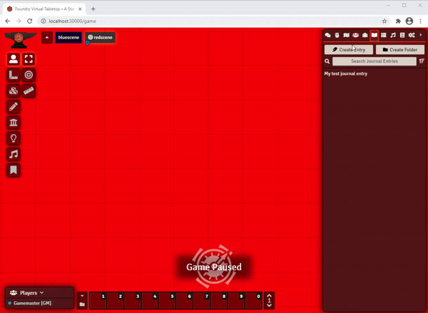

<!--- Downloads @ Latest Badge -->
<!--- replace <user>/<repo> with your username/repository -->
 

<!--- Forge Bazaar Install % Badge -->
<!--- replace <your-module-name> with the `name` in your manifest -->

# Journal Scaler
A [FoundryVTT](https://foundryvtt.com/) module that enables you to change the font sizes inside journal windows using <kbd>ctrl</kbd>+`mouseWheelUp` and <kbd>ctrl</kbd>+`mouseWheelDown`.

# Instructions
- Step 1: activate this module in your world 
- Step 2: hover your mouse cursor over a journal sheet window
- Step 3: hold down `ctrl` and use your mouse wheel to scroll either up or down for increasing or decreasing the font sizes, respectively

# Changelog

## 0.0.2 - Released on 2021-01-02
Fixed scaling bug when journal window was open but not hovered by the mouse.

## 0.0.1 - Released on 2021-01-01
Initial release. 

Got the basic funtionality to work.

# Acknowledgements

## LoFD's Module Template
This module relied heavily on [The League of Foundry Developer's FoundryVTT Module Template](https://github.com/League-of-Foundry-Developers/FoundryVTT-Module-Template). This is a great resource to get started in developing cool stuff for FoundryVTT!

## ruipin's libWrapper
This module uses [ruipin's libWrapper library](https://github.com/ruipin/fvtt-lib-wrapper/wiki/Modules-using-libWrapper). Take a look at his stuff if you want to develop modules for FVTT that override its default behaviors.

